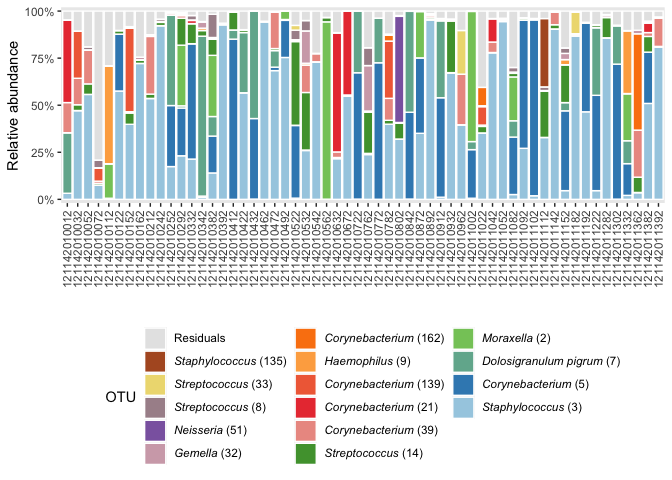

<!-- README.md is generated from README.Rmd. Please edit that file -->

# microbiomer

<!-- badges: start -->

<!-- badges: end -->

The goal of `microbiomer` is to provide a small set of tools to more
seamlessly integrate tools/functions from both the
[`phyloseq`](https://joey711.github.io/phyloseq/) and
[`tidyverse`](https://www.tidyverse.org)-packages.

**Note this is a package in development; although the functions were not
yet tested extensively within the context of this package, they were
tested across several projects as source code. Nevertheless, use these
functions at your own risk and please file a report if you come across
issues.**

## Installation

You can install the released version of `microbiomer` from
[CRAN](https://CRAN.R-project.org) with:

``` r
install.packages("microbiomer")
```

And the development version from [GitHub](https://github.com/) with:

``` r
# install.packages("devtools")
devtools::install_github("wsteenhu/microbiomer")
```

## Example

### Load packages

``` r
library(microbiomer); library(phyloseq)
library(tidyverse)
#> ── Attaching packages ─────────────────────────────────────── tidyverse 1.3.0 ──
#> ✓ ggplot2 3.3.3     ✓ purrr   0.3.4
#> ✓ tibble  3.0.6     ✓ dplyr   1.0.4
#> ✓ tidyr   1.1.2     ✓ stringr 1.4.0
#> ✓ readr   1.3.1     ✓ forcats 0.5.1
#> ── Conflicts ────────────────────────────────────────── tidyverse_conflicts() ──
#> x dplyr::filter() masks stats::filter()
#> x dplyr::lag()    masks stats::lag()
```

### Load data

``` r
data(ps_NP)
ps_NP
#> phyloseq-class experiment-level object
#> otu_table()   OTU Table:         [ 1793 taxa and 287 samples ]
#> sample_data() Sample Data:       [ 287 samples by 5 sample variables ]
#> tax_table()   Taxonomy Table:    [ 1793 taxa by 8 taxonomic ranks ]
```

The package includes nasopharyngeal microbiota data collected at 1 week,
1 month and 1 year of life. For more information, see `?ps_NP`.

### Convert

``` r
ps_NP_RA <- otu_table(ps_NP) %>%
  to_RA() 

ps_NP_RA[1:5,1:3] # depict example
#> OTU Table:          [5 taxa and 3 samples]
#>                      taxa are rows
#>                         121142010012 121144010012 121150010012
#> Moraxella_2             0.0002340276 0.0002837819 0.6826699800
#> Corynebacterium_5       0.0000000000 0.1827082249 0.0743064326
#> Dolosigranulum_pigrum_7 0.3214870783 0.2691671002 0.2292948222
#> Staphylococcus_3        0.0322958109 0.0283308897 0.0001018454
#> Haemophilus_9           0.0000000000 0.0004256728 0.0000000000
```

`to_RA` converts the otu\_table()-object nested within a
phyloseq-objected into a total-sum-scaled table (relative abundances
instead of raw reads).

### Filter

``` r
ps_NP %>% ntaxa()
#> [1] 1793

ps_NP %>%
  pres_abund_filter()
#> A total of 224 ASVs were found to be present at or above a level of confident detection (0.1% relative abundance) in at least 2 samples (n = 1569 ASVs excluded).
#> phyloseq-class experiment-level object
#> otu_table()   OTU Table:         [ 224 taxa and 287 samples ]
#> sample_data() Sample Data:       [ 287 samples by 5 sample variables ]
#> tax_table()   Taxonomy Table:    [ 224 taxa by 8 taxonomic ranks ]
```

Use a filter described by
[Subramanian](https://www.nature.com/articles/nature13421) *et al*.
(Nature, 2014) to filter phyloseq-objects.

### Extract metadata

``` r
ps_NP %>%
  meta_to_df() %>%
  head()
#>      sample_id seq_id visit_name age birth_mode bf_group_3m_yn
#> 1 121142010012   M001         w1   8        vag              1
#> 2 121144010012   M001         m1  30        vag              1
#> 3 121150010012   M001         y1 364        vag              1
#> 4 121142010032   M003         w1   7        vag              1
#> 5 121144010032   M003         m1  32        vag              1
#> 6 121150010032   M003         y1 361        vag              1
```

`meta_to_df()` convers the sample\_data()-objects within a
phyloseq-object into a tidyverse-formatted data table. Also try
`otu_tab_to_df()` and `ps_to_df()`

### Prepare for plotting

``` r
ps_NP %>%
  prep_bar(n = 5) %>%
  head()
#> # A tibble: 6 x 8
#>   sample_id  seq_id visit_name   age birth_mode bf_group_3m_yn OTU         value
#>   <fct>      <chr>  <ord>      <dbl> <chr>      <fct>          <fct>       <dbl>
#> 1 121142010… M001   w1             8 vag        1              *Moraxella…     7
#> 2 121142010… M001   w1             8 vag        1              *Staphyloc…   966
#> 3 121142010… M001   w1             8 vag        1              *Corynebac…     0
#> 4 121142010… M001   w1             8 vag        1              *Dolosigra…  9616
#> 5 121142010… M001   w1             8 vag        1              *Haemophil…     0
#> 6 121142010… M001   w1             8 vag        1              Residuals   19322
```

The function `prep_bar()` converts your phyloseq-object into an object
that can be readily used for plotting. It includes all metadata-columns,
a column ‘OTU’ (with formatted OTU-names) and a column ‘value’ with read
counts/relative abundances (depending on the format of the otu\_table).

### Barplot

``` r
ps_NP %>% 
  subset_samples(., birth_mode == "vag" & visit_name == "w1") %>% # select samples
  to_RA %>%
  create_bar()
```



Note this plotting function can be used in conjunction with other
ggplot2-functions/extensions, such as
`coord_flip()`/`ggforce::facet_col()` and `facet_wrap()`.
